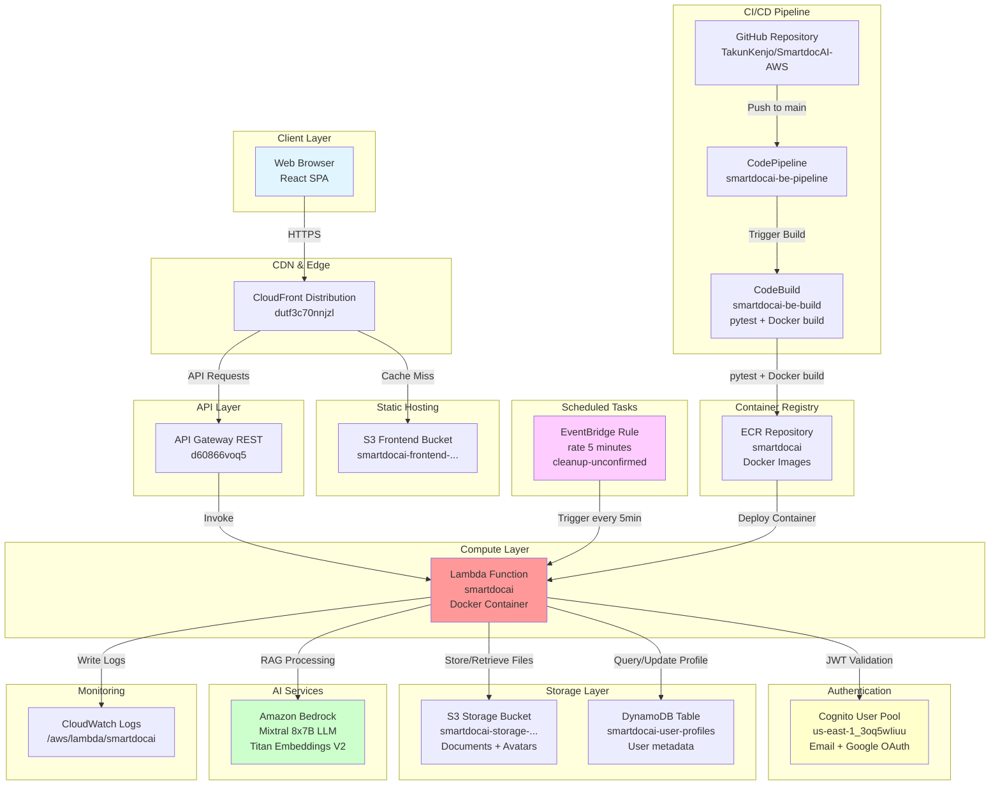
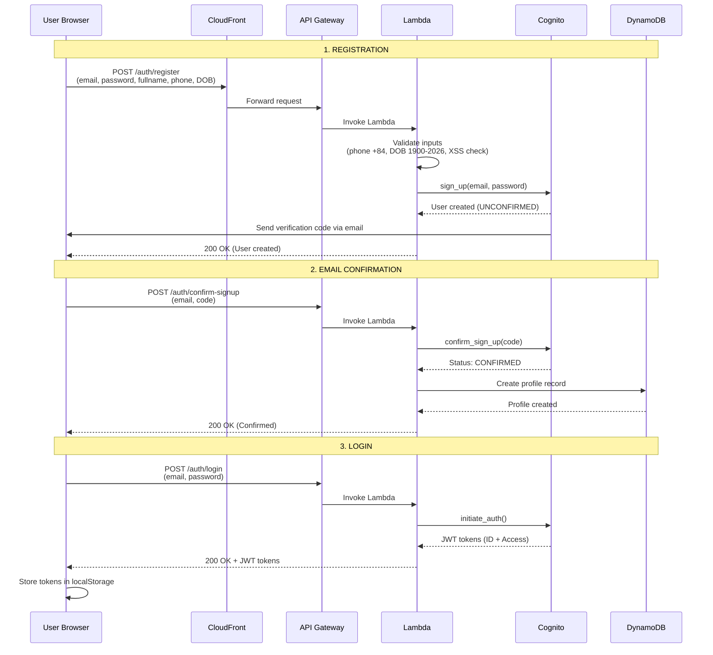
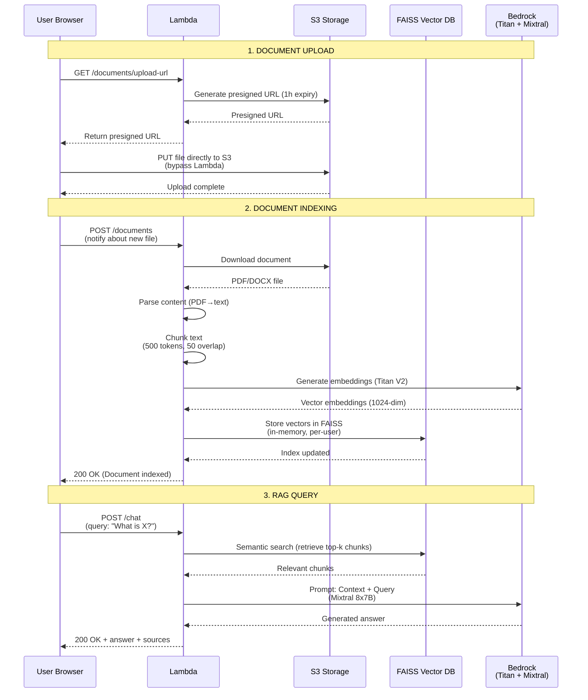
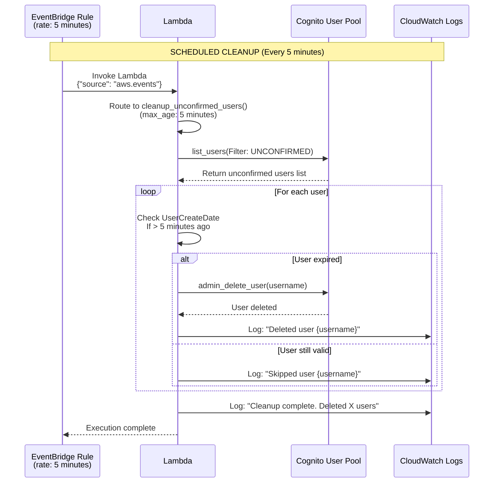
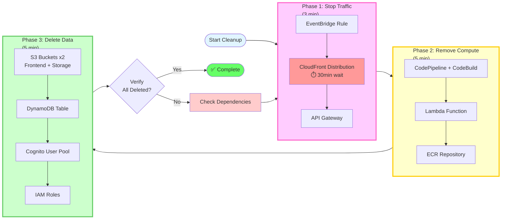
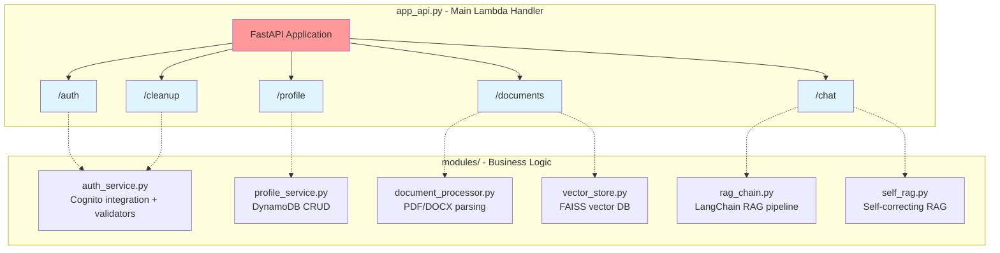
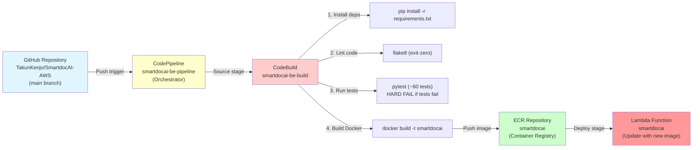
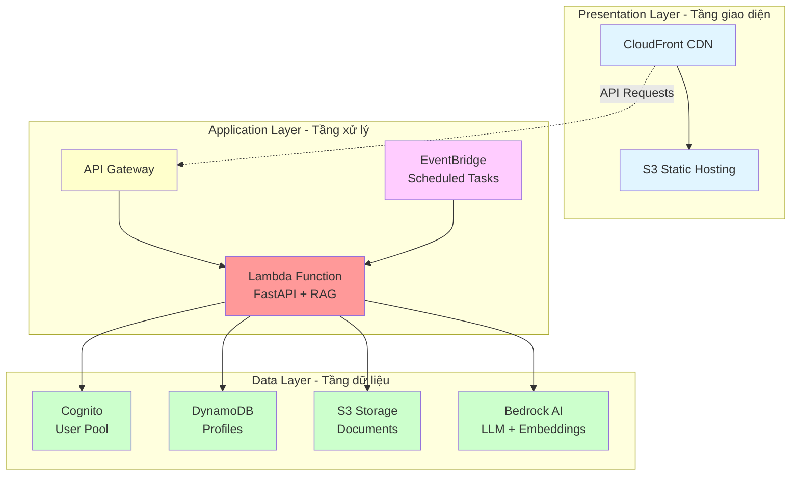
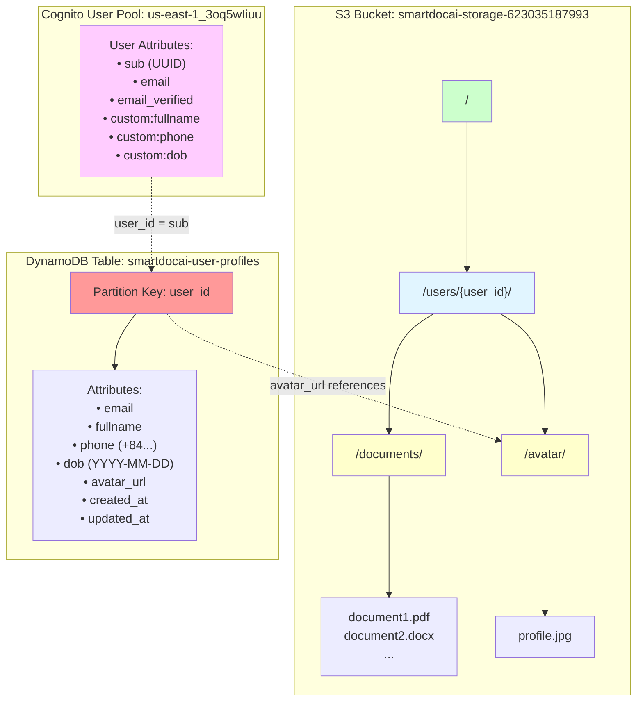
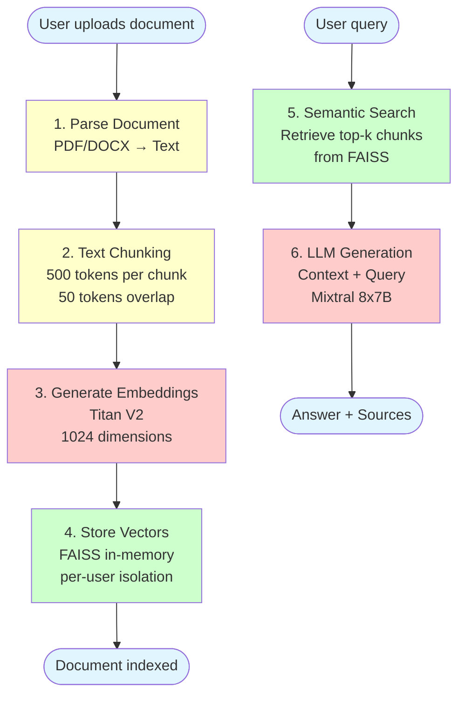

# Mermaid Diagrams Code

## Hướng dẫn sử dụng:

1. Copy code Mermaid của từng diagram
2. Vào trang https://mermaid.live/ 
3. Paste code vào editor
4. Export ảnh PNG (recommend: Scale 2x, transparent background)
5. Save ảnh với tên file đúng như path bên dưới
6. Copy ảnh vào folder `static/images/5-Workshop/5.1-Workshop-overview/`

---

## 1. Architecture Diagram

**File path:** `static/images/5-Workshop/5.1-Workshop-overview/architecture-diagram.png`

**Mermaid code:**

---

## 2. Authentication Flow (Register → Confirm → Login)

**File path:** `static/images/5-Workshop/5.1-Workshop-overview/auth-flow.png`

**Mermaid code:**

---

## 3. Document Upload & RAG Query Flow

**File path:** `static/images/5-Workshop/5.1-Workshop-overview/rag-flow.png`

**Mermaid code:**

---

## 4. EventBridge Auto-Cleanup Flow

**File path:** `static/images/5-Workshop/5.1-Workshop-overview/eventbridge-cleanup.png`

**Mermaid code:**

---

## Export Settings (recommend):

- **Format:** PNG
- **Background:** Transparent (hoặc white nếu cần)
- **Scale:** 2x (cho chất lượng cao)
- **Theme:** Default

## Checklist sau khi export:

- [ ] architecture-diagram.png (14 AWS services)
- [ ] auth-flow.png (Registration → Confirmation → Login)
- [ ] rag-flow.png (Upload → Indexing → Query)
- [ ] eventbridge-cleanup.png (Scheduled cleanup)
- [ ] lambda-modules.png (Lambda code structure tree)
- [ ] cicd-pipeline.png (GitHub → CodePipeline → CodeBuild → ECR → Lambda)
- [ ] three-tier-architecture.png (3-tier layering model)
- [ ] storage-structure.png (S3 + DynamoDB data model)
- [ ] rag-pipeline-simple.png (6-step RAG process flowchart)
- [ ] cleanup-resources-flow.png (3-phase simplified cleanup flow)
- [ ] Copy tất cả vào: `static/images/5-Workshop/5.1-Workshop-overview/`

---

## 10. AWS Resources Cleanup Flow (Simplified)

**File path:** `static/images/5-Workshop/5.6-Conclusion/cleanup-resources-flow.png`

**Mermaid code:**

---

## 5. Lambda Modules Structure

**File path:** `static/images/5-Workshop/5.1-Workshop-overview/lambda-modules.png`

**Mermaid code:**

---

## 6. CI/CD Pipeline Flow

**File path:** `static/images/5-Workshop/5.1-Workshop-overview/cicd-pipeline.png`

**Mermaid code:**

---

## 7. Three-Tier Architecture

**File path:** `static/images/5-Workshop/5.1-Workshop-overview/three-tier-architecture.png`

**Mermaid code:**

---

## 8. Storage Structure (S3 + DynamoDB Data Model)

**File path:** `static/images/5-Workshop/5.1-Workshop-overview/storage-structure.png`

**Mermaid code:**

---

## 9. RAG Pipeline - Simple Flowchart

**File path:** `static/images/5-Workshop/5.1-Workshop-overview/rag-pipeline-simple.png`

**Mermaid code:**

