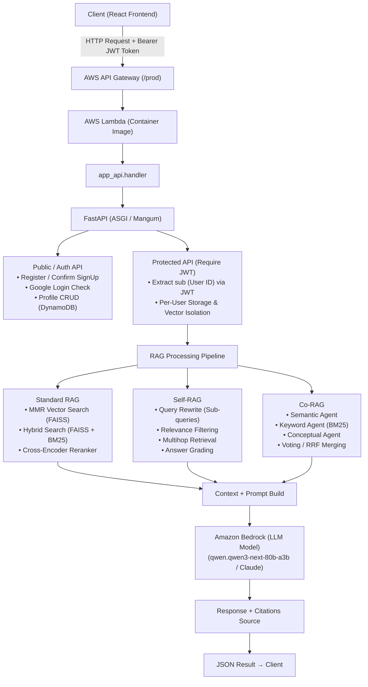

### 1. Explanation of Backend Directory Structure

#### 1.1. Directory Overview

```bash
backend/                               # Root directory of the backend
├── lambdas/                           # AWS Lambda Custom Triggers & Event Handlers
│   └── presignup_check/
│       └── lambda_function.py         # Cognito Trigger: Google Account & Email Linking
│
├── modules/                           # Service layer & AI / RAG / Storage business logic
│   ├── __init__.py                    # Module initializer
│   ├── auth_service.py                # Registration, email confirmation & DynamoDB profile management
│   ├── cognito_auth.py                # JWT Token authentication via AWS Cognito JWKS / RSA
│   ├── co_rag.py                      # Co-RAG (Multi-Agent RAG) Pipeline
│   ├── document_processor.py          # PDF/DOCX extraction & text chunking
│   ├── dynamo_storage.py              # AWS DynamoDB data operations (User Profiles)
│   ├── language_detector.py           # User query language detection (Vietnamese / English / ...)
│   ├── profile_service.py             # User profile, avatar management & password change
│   ├── rag_chain.py                   # RAG Chain integrating Amazon Bedrock (Qwen 3 / Claude)
│   ├── reranker.py                    # Reranking using Cross-Encoder (mMARCO MiniLM)
│   ├── s3_storage.py                  # File management, presigned URLs, metadata on S3
│   ├── self_rag.py                    # Self-RAG Pipeline (Query Rewrite, Answer Grading)
│   └── vector_store.py                # FAISS Vector Store management & Titan Embeddings V2
│
├── app_api.py                         # FastAPI Entry Point, Mangum Lambda Handler & Router
├── config.py                          # System configuration, AWS Services & Hyperparameters
├── run.py                             # Script to run local dev server with Uvicorn
├── deploy_to_lambda.py                # Automated deployment script (Docker -> ECR -> Lambda)
├── Dockerfile                         # Container Image spec (AWS Lambda Python 3.11 base)
├── buildspec.yml                      # CI/CD Pipeline configuration for AWS CodeBuild
├── cognito_policy.json                # IAM policy permissions for AWS Cognito Trigger
├── cors.json                          # S3 Bucket CORS configuration for Frontend uploads
├── requirements.txt                   # Python package dependencies
│
├── test_auth_service_unit.py          # Unit Tests for AuthService & Mocks (Cognito/DynamoDB)
└── test_validators_unit.py            # Unit Tests for Validation (Phone, DOB, Fullname, Edge Cases)
```

---

#### 1.2. Detailed Explanation of Directories and Files

##### `app_api.py`
The main Entry Point layer routing all REST API requests across the Backend system.

- **FastAPI Framework & Mangum Wrapper**: 
  - Initializes the FastAPI application with `root_path="/prod"` aligned with the API Gateway stage.
  - Uses **Mangum** as an ASGI adapter to bridge HTTP Events from AWS API Gateway to FastAPI's ASGI app.
  - Adds a `global_exception_handler` ensuring all unhandled 500 errors return properly formatted JSON through `CORSMiddleware`, preventing false browser "CORS Policy Blocked" errors.

- **Per-User Isolation / Multi-tenancy Mechanism**:
  - All operations related to documents, chat, and vector databases pass through the `require_user_id()` middleware/helper.
  - This function extracts `sub` (User ID) from the Cognito-issued JWT Bearer token.
  - Ensures each user maintains isolated tracking files on S3/Disk: `processed_files/{user_id}.json`, `chat_history/{user_id}.json`, and only accesses their dedicated FAISS index at `vectorstore/{user_id}/smartdoc_index`.

- **AWS Lambda Entry Point (`handler`)**:
  - Automatically routes requests: If the event originates from EventBridge (`aws.events`), Lambda executes a cleanup task for unconfirmed accounts (`cleanup_unconfirmed_users`). For standard HTTP requests, execution is delegated to Mangum.

- **API Endpoint Collection**:
  - **Status & Configuration**: `GET /api/status`, `GET /api/config`, `POST /api/config`.
  - **Document Management**: `GET /api/files`, `POST /api/upload-url` (S3 Presigned URL), `POST /api/process` (Text chunking & embedding), `POST /api/delete-document`, `POST /api/clear-documents`.
  - **RAG Conversation**: `POST /api/chat` (Supports Self-RAG, Co-RAG, Hybrid Search & Reranker), `GET /api/history`, `POST /api/clear-history`.
  - **User Authentication**: `POST /api/auth/register`, `POST /api/auth/confirm-signup`, `POST /api/auth/google/check-email`, `POST /api/auth/resolve-login-username`.
  - **User Profile**: `GET /api/profile`, `PUT /api/profile/personal-info`, `PUT /api/profile/avatar`, `POST /api/profile/change-password`.

---

##### `config.py`
Centralized management for system configurations, environment variables, and RAG hyperparameters.

- **Execution Environment**: Automatically detects the runtime environment (AWS Lambda or Local) via the `AWS_LAMBDA_FUNCTION_NAME` environment variable. In Lambda, the working temporary directory automatically switches to `/tmp/`.
- **AWS Services Integration**:
  - AWS Bedrock LLM Model: `qwen.qwen3-next-80b-a3b` (or equivalent Claude/Qwen models).
  - Amazon Titan Embedding: `amazon.titan-embed-text-v2:0` (1024 dimensions).
  - AWS Cognito Pool ID & Client ID.
  - Amazon DynamoDB Table: `smartdocai-user-profiles`.
  - Amazon S3 Bucket: `smartdocai-storage-623035187993`.
- **RAG & Vector Search Hyperparameters**:
  - Chunking: `CHUNK_SIZE = 1500`, `CHUNK_OVERLAP = 200`.
  - MMR Retrieval: `RETRIEVAL_TOP_K = 10`, `FETCH_K = 30`, `LAMBDA_MULT = 0.7`.
  - Hybrid Search Weights: Vector 60% (`0.6`), BM25 40% (`0.4`).
  - Co-RAG & Self-RAG Hyperparameters: Minimum required votes (`MIN_VOTES = 2`), number of chunks retrieved per agent (`TOP_K = 5`).

---

##### `modules/` (Business Logic & AI RAG Layer)
Houses all core processing logic of the backend.

- **`auth_service.py`**:
  - Integrates Cognito IDP SDK (`boto3.client('cognito-idp')`).
  - Manages new user registration (`sign_up`), sends email verification codes (`confirm_sign_up`), and initializes default profile data in DynamoDB.
  - Supports username resolution between Cognito Native Users (email) and Federated Users (Google).
  - Provides `cleanup_unconfirmed_users()` to purge unverified accounts older than 5 minutes.

- **`cognito_auth.py`**:
  - Verifies incoming client JWT Tokens by downloading public key sets (JWKS) from the Cognito Endpoint (`https://cognito-idp.{region}.amazonaws.com/{user_pool_id}/.well-known/jwks.json`).
  - Performs RSA digital signature verification and token expiration (`exp`) validation.

- **`profile_service.py`**:
  - Manages user profiles within the DynamoDB `smartdocai-user-profiles` table.
  - **Self-healing mechanism**: Automatically creates a new profile record when a user signs in via Google for the first time without an existing database record.
  - Supports direct password changes via Cognito Admin APIs (`admin_set_user_password`).
  - Handles upload and storage of user avatar images as Base64 strings or S3 URLs.

- **`document_processor.py`**:
  - Extracts raw text content from `.pdf` files (combining PyPDF/PyMuPDF) and `.docx` files (python-docx).
  - Utilizes LangChain's `RecursiveCharacterTextSplitter` to segment text into smaller chunks based on `chunk_size` and `chunk_overlap`.
  - Preserves full page location (`page`) and source filename (`source`) in each chunk's metadata.

- **`vector_store.py`**:
  - Manages **FAISS Vector Store** on a per-user basis.
  - Combines `LangChain` with AWS Bedrock `BedrockEmbeddings` to transform text chunks into 1024-dimensional vectors.
  - Reads/Writes FAISS indices directly to/from S3 Buckets organized by user directories: `vectorstore/{user_id}/smartdoc_index`.
  - Initializes and maintains `BM25Retriever` to power the Hybrid Search algorithm.

- **`rag_chain.py`**:
  - Builds a standard RAG Chain connected to Amazon Bedrock LLM.
  - Supports diverse retrieval modes: Vector Search (MMR), Hybrid Search (FAISS + BM25 via EnsembleRetriever).
  - Integrates `scan_docs_by_question_numbers()` to scan and extract text sections matching question/chapter/section numbers requested by the user.
  - Formats prompts optimized for the LLM to deliver accurate answers based on retrieved contexts.

- **`self_rag.py`**:
  - Implements **Self-RAG (Self-Reflective RAG)** architecture:
    1. *Query Rewriter*: The LLM analyzes and generates sub-queries to expand the search space.
    2. *Relevance Filter*: Evaluates and filters out irrelevant text chunks before sending to the LLM.
    3. *Multihop Retrieval*: Iterates retrieval if the initial context is insufficient to answer the query.
    4. *Answer Grading*: Verifies Groundedness and detects Hallucinations in LLM responses.

- **`co_rag.py`**:
  - Implements **Co-RAG (Collaborative / Multi-Agent RAG)** architecture:
    - Concurrently runs 3 independent search agents:
      - *Semantic Agent*: Semantic similarity search.
      - *Keyword Agent*: Exact keyword match (BM25).
      - *Conceptual Agent*: Search based on related concepts and topics.
    - Applies fusion strategies (*Voting Strategy* or *Reciprocal Rank Fusion - RRF*) to select the optimal set of chunks.

- **`reranker.py`**:
  - Employs Cross-Encoder model `cross-encoder/mmarco-mMiniLMv2-L12-H384-v1` to calculate direct relevance scores between (Query, Chunk) pairs.
  - Pre-downloads and caches the model inside the container cache (`/var/task/hf_cache`) to optimize response latency on AWS Lambda.

- **`language_detector.py`**:
  - Detects input query language (Vietnamese, English, etc.) to append tailored prompt instructions for LLM responses in the user's requested language.

- **`s3_storage.py` & `dynamo_storage.py`**:
  - AWS infrastructure storage manipulation layer. `s3_storage.py` provides helpers for S3 Presigned URLs, file upload/download, and JSON metadata operations. `dynamo_storage.py` provides helper functions wrapping DynamoDB DocumentClient.

---

##### `lambdas/presignup_check/`
Contains source code for **AWS Cognito Custom Lambda Trigger**.

- **`lambda_function.py`**:
  - Intercepts `PreSignUp_ExternalProvider` events triggered during Google OAuth2 first-time login.
  - Checks whether the email already exists in the User Pool as a native Email/Password account.
  - If matched, automatically calls `admin_link_provider_for_user` API to link the Google account to the native account, preventing duplicate user entities.
  - Automatically sets `autoConfirmUser = True` and `autoVerifyEmail = True`.

---

##### DevOps & Serverless Container Deployment

- **`Dockerfile`**:
  - Uses official AWS Lambda Python base image: `public.ecr.aws/lambda/python:3.11`.
  - Installs Python dependencies from `requirements.txt` into `${LAMBDA_TASK_ROOT}`.
  - Pre-creates `static` folder to avoid static file mount issues at startup.
  - Sets default CMD: `CMD [ "app_api.handler" ]`.

- **`deploy_to_lambda.py`**:
  - Python script automating 5 deployment steps:
    1. Fetch AWS Account ID and authenticate with ECR Registry.
    2. Check/Create ECR Repository `smartdocai`.
    3. Build Docker Image (disables `DOCKER_BUILDKIT` for AWS Lambda compatibility).
    4. Push Docker Image to AWS ECR.
    5. Update Lambda Function code (`aws lambda update-function-code`).

- **`buildspec.yml`**:
  - Configuration file for **AWS CodeBuild** in the CI/CD pipeline. Automatically logs into ECR, installs test dependencies (`pytest`, `flake8`), performs linting (`flake8`), executes Unit Tests (`pytest test_*_unit.py`) with Hard Fail enforcement (halts pipeline on failure), builds Docker image, pushes to ECR, and triggers Lambda code update upon main branch push.

- **`cors.json`**:
  - S3 Bucket CORS policy restricting origins to `AllowedOrigins` (CloudFront distribution `https://dutf3c70nnjzl.cloudfront.net` and local dev `localhost:5173`/`5174`), enhancing storage security.

- **`test_validators_unit.py` & `test_auth_service_unit.py`**:
  - Complete automated Unit Test suite executed in CI/CD pipeline:
    - `test_validators_unit.py`: Tests Vietnamese phone number formats (09x/03x/07x/08x/05x), birthdate formatting YYYY-MM-DD (years 1900-2026), Unicode full names / XSS filtering, and boundary edge cases.
    - `test_auth_service_unit.py`: Tests AuthService using Mocks for AWS Cognito SDK (`boto3.client('cognito-idp')`) and DynamoDB SDK (`boto3.resource('dynamodb')`).

- **`run.py`**:
  - Helper script for Local Development environment. Checks Python dependencies, downloads offline JS assets for React UI (Babel, React DOM), and opens the web browser at `http://127.0.0.1:8000`.

---

### 2. Data Flow and Backend Architecture



---

### 3. AWS Infrastructure Interaction (AWS Services Summary)

| AWS Service | Purpose & Role in Backend |
| :--- | :--- |
| **AWS Lambda** | Serverless execution environment running the Docker container containing the FastAPI backend and RAG pipelines. |
| **Amazon Bedrock** | Generative AI service acting as LLM response generator and vector embedding model provider (Amazon Titan Embeddings V2). |
| **AWS Cognito** | Manages user sign-up, authentication, JWT token issuance, and Google OAuth2 federation events. |
| **Amazon S3** | Stores raw source documents (.pdf, .docx), handles presigned upload URLs, holds per-user FAISS Vector Indices and JSON metadata. |
| **Amazon DynamoDB** | NoSQL database storing detailed user profile records (Profile, Full Name, Phone Number, Date of Birth, Avatar). |
| **Amazon ECR** | Container registry storing backend Docker images deployed to AWS Lambda. |
| **AWS API Gateway** | Public RESTful API gateway acting as a reverse proxy targeting the AWS Lambda function. |
| **Amazon EventBridge** | Scheduled event service (5-minute Cron rule) triggering Lambda to clean up unconfirmed temporary user accounts (`cleanup_unconfirmed_users`). |
