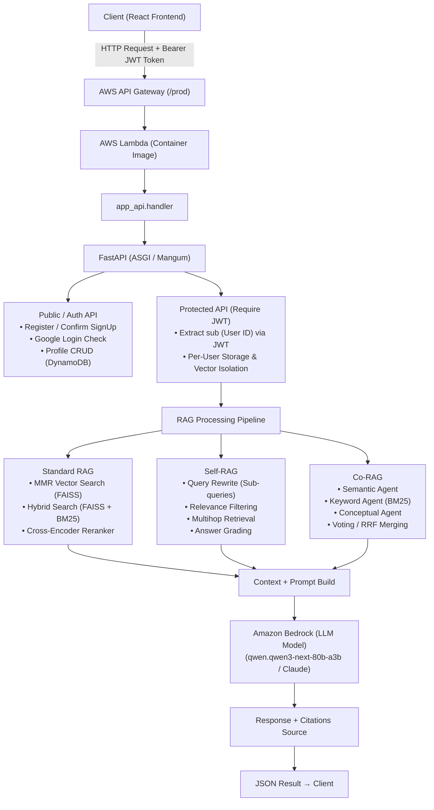

### 1. Giải thích cấu trúc thư mục Backend

#### 1.1. Cấu trúc tổng quan

```bash
backend/                               # Thư mục gốc của backend
├── lambdas/                           # AWS Lambda Custom Triggers & Event Handlers
│   └── presignup_check/
│       └── lambda_function.py         # Cognito Trigger: Liên kết tài khoản Google & Email
│
├── modules/                           # Tầng dịch vụ & Xử lý nghiệp vụ AI / RAG / Storage
│   ├── __init__.py                    # Module initializer
│   ├── auth_service.py                # Quản lý đăng ký, xác nhận email & profile DynamoDB
│   ├── cognito_auth.py                # Xác thực JWT Token từ AWS Cognito JWKS / RSA
│   ├── co_rag.py                      # Pipeline Co-RAG (Multi-Agent RAG)
│   ├── document_processor.py          # Trích xuất PDF/DOCX & chunking văn bản
│   ├── dynamo_storage.py              # Thao tác dữ liệu AWS DynamoDB (User Profiles)
│   ├── language_detector.py           # Phát hiện ngôn ngữ câu hỏi (Việt / Anh / ...)
│   ├── profile_service.py             # Quản lý hồ sơ người dùng, avatar, đổi mật khẩu
│   ├── rag_chain.py                   # RAG Chain kết nối Amazon Bedrock (Qwen 3 / Claude)
│   ├── reranker.py                    # Reranking bằng Cross-Encoder (mMARCO MiniLM)
│   ├── s3_storage.py                  # Quản lý file, presigned URL, metadata trên S3
│   ├── self_rag.py                    # Pipeline Self-RAG (Query Rewrite, Answer Grading)
│   └── vector_store.py                # Quản lý FAISS Vector Store & Titan Embeddings V2
│
├── app_api.py                         # FastAPI Entry Point, Mangum Lambda Handler & Router
├── config.py                          # Cấu hình hệ thống, AWS Services & Hyperparameters
├── run.py                             # Script chạy local dev server Uvicorn
├── deploy_to_lambda.py                # Script tự động Deployment (Docker -> ECR -> Lambda)
├── Dockerfile                         # Container Image spec (AWS Lambda Python 3.11 base)
├── buildspec.yml                      # Cấu hình CI/CD Pipeline cho AWS CodeBuild
├── cognito_policy.json                # Policy phân quyền cho AWS Cognito Trigger
├── cors.json                          # Cấu hình CORS S3 Bucket cho Frontend upload
├── requirements.txt                   # Danh sách các thư viện Python phụ thuộc
│
├── test_auth_service_unit.py          # Unit Tests cho AuthService & Mocks (Cognito/DynamoDB)
└── test_validators_unit.py            # Unit Tests cho Validation (Phone, DOB, Fullname, Edge Cases)
```

---

#### 1.2. Giải thích chi tiết từng thư mục và file

##### `app_api.py`
Tầng Entry Point chính điều hướng toàn bộ REST API của hệ thống Backend.

- **FastAPI Framework & Mangum Wrapper**: 
  - Khởi tạo ứng dụng FastAPI với `root_path="/prod"` phù hợp với stage API Gateway.
  - Sử dụng **Mangum** làm ASGI adapter để chuyển đổi giữa HTTP Event từ AWS API Gateway và ASGI app của FastAPI.
  - Bổ sung `global_exception_handler` đảm bảo mọi lỗi 500 unhandled đều trả về JSON đúng chuẩn đi qua `CORSMiddleware`, tránh trường hợp browser bị báo lỗi giả "CORS Policy Blocked".

- **Cơ chế Phân lập Người dùng (Per-User Isolation / Multi-tenancy)**:
  - Tất cả các thao tác liên quan tới tài liệu, chat, vector database đều qua middleware/helper `require_user_id()`.
  - Hàm này trích xuất `sub` (User ID) từ JWT Bearer token được cấp bởi Cognito.
  - Đảm bảo mỗi người dùng có file lưu vết riêng trên S3/Disk: `processed_files/{user_id}.json`, `chat_history/{user_id}.json` và chỉ truy cập vào index FAISS riêng tại `vectorstore/{user_id}/smartdoc_index`.

- **AWS Lambda Entry Point (`handler`)**:
  - Tự động phân nhánh lời gọi: Nếu event xuất phát từ EventBridge (`aws.events`), Lambda chạy tác vụ dọn dẹp các tài khoản chưa kích hoạt (`cleanup_unconfirmed_users`). Nếu là HTTP request, lời gọi được chuyển tiếp sang Mangum.

- **Tập hợp Endpoints API**:
  - **Trạng thái & Cấu hình**: `GET /api/status`, `GET /api/config`, `POST /api/config`.
  - **Quản lý Tài liệu**: `GET /api/files`, `POST /api/upload-url` (Presigned URL S3), `POST /api/process` (Cắt nhỏ & Embed file), `POST /api/delete-document`, `POST /api/clear-documents`.
  - **Hội thoại RAG**: `POST /api/chat` (Hỗ trợ Self-RAG, Co-RAG, Hybrid Search & Reranker), `GET /api/history`, `POST /api/clear-history`.
  - **Xác thực Người dùng**: `POST /api/auth/register`, `POST /api/auth/confirm-signup`, `POST /api/auth/google/check-email`, `POST /api/auth/resolve-login-username`.
  - **Hồ sơ Cá nhân**: `GET /api/profile`, `PUT /api/profile/personal-info`, `PUT /api/profile/avatar`, `POST /api/profile/change-password`.

---

##### `config.py`
Quản lý tập trung toàn bộ cấu hình hệ thống, biến môi trường và siêu tham số RAG.

- **Môi trường Thực thi**: Tự động phát hiện môi trường thực thi (AWS Lambda hay Local) thông qua biến `AWS_LAMBDA_FUNCTION_NAME`. Trong Lambda, đường dẫn làm việc tạm được tự động chuyển về `/tmp/`.
- **AWS Services Integration**:
  - AWS Bedrock LLM Model: `qwen.qwen3-next-80b-a3b` (hoặc các dòng Claude/Qwen tương đương).
  - Amazon Titan Embedding: `amazon.titan-embed-text-v2:0` (Dimension 1024).
  - AWS Cognito Pool ID & Client ID.
  - Amazon DynamoDB Table: `smartdocai-user-profiles`.
  - Amazon S3 Bucket: `smartdocai-storage-623035187993`.
- **Tham số RAG & Vector Search**:
  - Chunking: `CHUNK_SIZE = 1500`, `CHUNK_OVERLAP = 200`.
  - MMR Retrieval: `RETRIEVAL_TOP_K = 10`, `FETCH_K = 30`, `LAMBDA_MULT = 0.7`.
  - Hybrid Search Weights: Vector 60% (`0.6`), BM25 40% (`0.4`).
  - Co-RAG & Self-RAG Hyperparameters: Số lượng votes tối thiểu (`MIN_VOTES = 2`), số lượng chunks thu thập per-agent (`TOP_K = 5`).

---

##### `modules/` (Tầng nghiệp vụ & AI RAG)
Nơi chứa toàn bộ logic xử lý chính của backend.

- **`auth_service.py`**:
  - Tích hợp Cognito IDP SDK (`boto3.client('cognito-idp')`).
  - Thực hiện đăng ký tài khoản mới (`sign_up`), gửi mã xác nhận email (`confirm_sign_up`) và khởi tạo sẵn dữ liệu profile mặc định trong DynamoDB.
  - Hỗ trợ phân giải username giữa Cognito Native User (email) và Federated User (Google).
  - Hàm `cleanup_unconfirmed_users()` hỗ trợ dọn dẹp các tài khoản rác tạo ra quá 5 phút mà chưa xác minh email.

- **`cognito_auth.py`**:
  - Xác minh JWT Token gửi lên từ client bằng cách tải bộ khóa công khai (JWKS) từ Cognito Endpoint (`https://cognito-idp.{region}.amazonaws.com/{user_pool_id}/.well-known/jwks.json`).
  - Thực hiện verify chữ ký số RSA và thời hạn hết hạn (exp) của token.

- **`profile_service.py`**:
  - Quản lý hồ sơ người dùng trong bảng DynamoDB `smartdocai-user-profiles`.
  - Cơ chế **Self-healing**: Tự tạo bản ghi profile mới khi người dùng đăng nhập bằng Google lần đầu mà chưa có bản ghi trong database.
  - Đổi mật khẩu tài khoản trực tiếp qua Cognito Admin APIs (`admin_set_user_password`).
  - Xử lý upload và lưu trữ ảnh đại diện Avatar dưới dạng Base64 hoặc URL S3.

- **`document_processor.py`**:
  - Trích xuất nội dung văn bản thô từ file `.pdf` (kết hợp PyPDF/PyMuPDF) và `.docx` (python-docx).
  - Sử dụng `RecursiveCharacterTextSplitter` của LangChain để phân tách văn bản thành các đoạn nhỏ (chunks) theo đúng `chunk_size` và `chunk_overlap`.
  - Lưu giữ đầy đủ thông tin vị trí trang (page) và tên file nguồn (source) trong metadata của từng chunk.

- **`vector_store.py`**:
  - Quản lý **FAISS Vector Store** per-user.
  - Sử dụng `LangChain` kết hợp AWS Bedrock `BedrockEmbeddings` để biến đổi các đoạn văn bản thành vector 1024 chiều.
  - Đọc/Ghi index FAISS trực tiếp lên S3 Bucket theo từng thư mục `vectorstore/{user_id}/smartdoc_index`.
  - Khởi tạo và duy trì `BM25Retriever` phục vụ thuật toán Hybrid Search.

- **`rag_chain.py`**:
  - Xây dựng RAG Chain tiêu chuẩn kết nối tới Amazon Bedrock LLM.
  - Hỗ trợ cơ chế tìm kiếm đa dạng: Vector Search (MMR), Hybrid Search (FAISS + BM25 via EnsembleRetriever).
  - Tích hợp hàm `scan_docs_by_question_numbers()` nhằm tự động quét và trích xuất các đoạn văn bản chứa câu hỏi/chương/mục tương ứng với câu hỏi của người dùng.
  - Định dạng prompt tiếng Việt chuyên sâu giúp LLM đưa ra câu trả lời chuẩn xác dựa trên context được truy xuất.

- **`self_rag.py`**:
  - Triển khai kiến trúc **Self-RAG (Self-Reflective RAG)**:
    1. *Query Rewriter*: LLM tự động phân tích và sinh ra các câu hỏi phụ (sub-queries) để mở rộng không gian tìm kiếm.
    2. *Relevance Filter*: Đánh giá và lọc bỏ các đoạn văn bản không liên quan trước khi gửi cho LLM.
    3. *Multihop Retrieval*: Lặp lại truy vấn nếu thông tin truy xuất chưa đủ trả lời.
    4. *Answer Grading*: Kiểm tra tính Groundedness và phát hiện Hallucination (thông tin sai sự thật) trong câu trả lời của LLM.

- **`co_rag.py`**:
  - Triển khai kiến trúc **Co-RAG (Collaborative / Multi-Agent RAG)**:
    - Chạy đồng thời 3 Agent tìm kiếm độc lập:
      - *Semantic Agent*: Tìm kiếm dựa trên ngữ nghĩa câu hỏi.
      - *Keyword Agent*: Tìm kiếm dựa trên từ khóa chính xác (BM25).
      - *Conceptual Agent*: Tìm kiếm dựa trên khái niệm và chủ đề liên quan.
    - Áp dụng chiến lược gộp kết quả (*Voting Strategy* hoặc *Reciprocal Rank Fusion - RRF*) để chọn ra danh sách chunks tối ưu nhất.

- **`reranker.py`**:
  - Sử dụng mô hình Cross-Encoder `cross-encoder/mmarco-mMiniLMv2-L12-H384-v1` để tính điểm số liên quan trực tiếp giữa cặp (Query, Chunk).
  - Tải và nạp trước mô hình trong cache container (`/var/task/hf_cache`) giúp tối ưu tốc độ phản hồi trên AWS Lambda.

- **`language_detector.py`**:
  - Nhận diện ngôn ngữ đầu vào (Việt, Anh...) để bổ sung hướng dẫn phù hợp cho LLM phản hồi đúng ngôn ngữ người dùng yêu cầu.

- **`s3_storage.py` & `dynamo_storage.py`**:
  - Tầng thao tác hạ tầng lưu trữ AWS. `s3_storage.py` cung cấp các hàm tạo S3 Presigned URL, upload/download file, save/load các file JSON metadata. `dynamo_storage.py` cung cấp helper thao tác với DynamoDB DocumentClient.

---

##### `lambdas/presignup_check/`
Chứa mã nguồn của **AWS Cognito Custom Lambda Trigger**.

- **`lambda_function.py`**:
  - Bắt sự kiện `PreSignUp_ExternalProvider` khi người dùng đăng nhập lần đầu bằng Google OAuth2.
  - Kiểm tra xem email đó đã tồn tại trong User Pool dưới dạng tài khoản Email/Mật khẩu bản địa chưa.
  - Nếu đã tồn tại, tự động gọi API `admin_link_provider_for_user` để liên kết tài khoản Google với tài khoản bản địa, giúp người dùng có thể đăng nhập bằng cả 2 phương thức mà không bị nhân đôi dữ liệu.
  - Tự động bật `autoConfirmUser = True` và `autoVerifyEmail = True`.

---

##### DevOps & Triển khai Container Serverless

- **`Dockerfile`**:
  - Sử dụng base image chính thức của AWS Lambda Python: `public.ecr.aws/lambda/python:3.11`.
  - Cài đặt toàn bộ các thư viện Python trong `requirements.txt` vào thư mục `${LAMBDA_TASK_ROOT}`.
  - Tạo sẵn thư mục `static` để tránh lỗi mount file tĩnh lúc ứng dụng khởi động.
  - Thiết lập lệnh chạy mặc định: `CMD [ "app_api.handler" ]`.

- **`deploy_to_lambda.py`**:
  - Script Python tự động hóa 5 bước triển khai ứng dụng:
    1. Lấy thông tin AWS Account ID và đăng nhập ECR Registry.
    2. Kiểm tra/Tạo ECR Repository `smartdocai`.
    3. Build Docker Image ứng dụng (tắt `DOCKER_BUILDKIT` để đảm bảo định dạng tương thích AWS Lambda).
    4. Push Docker Image lên AWS ECR.
    5. Cập nhật mã nguồn Lambda Function (`aws lambda update-function-code`).

- **`buildspec.yml`**:
  - Tệp cấu hình cho **AWS CodeBuild** nằm trong pipeline CI/CD tự động. Tự động đăng nhập ECR, cài đặt test dependencies (`pytest`, `flake8`), kiểm tra linting (`flake8`), thực thi tự động toàn bộ Unit Tests (`pytest test_*_unit.py`) với cơ chế Hard Fail (ngắt pipeline nếu test lỗi), build Docker image, push image lên ECR và ra lệnh Lambda cập nhật image mới mỗi khi push lên nhánh main.

- **`cors.json`**:
  - Tệp cấu hình CORS S3 Bucket giới hạn truy cập theo danh sách `AllowedOrigins` (CloudFront distribution `https://dutf3c70nnjzl.cloudfront.net` và local dev `localhost:5173`/`5174`), nâng cao tính bảo mật dữ liệu lưu trữ.

- **`test_validators_unit.py` & `test_auth_service_unit.py`**:
  - Bộ Unit Tests tự động hoàn chỉnh chạy trong CI/CD pipeline:
    - `test_validators_unit.py`: Kiểm thử validation số điện thoại chuẩn Việt Nam (09x/03x/07x/08x/05x), định dạng ngày sinh YYYY-MM-DD (năm 1900-2026), họ tên Unicode/lọc XSS, và các boundary edge cases.
    - `test_auth_service_unit.py`: Kiểm thử AuthService sử dụng Mocks cho AWS Cognito SDK (`boto3.client('cognito-idp')`) và DynamoDB SDK (`boto3.resource('dynamodb')`).

- **`run.py`**:
  - Trợ lý chạy ứng dụng ở môi trường Local Development. Tự động kiểm tra cài đặt thư viện Python, tải các file JS offline cho React UI (Babel, React DOM) và tự động mở trình duyệt web tại `http://127.0.0.1:8000`.

---

### 2. Luồng dữ liệu và Kiến trúc Backend



---

### 3. Tương tác với Hạ tầng AWS (AWS Services Summary)

| Dịch vụ AWS | Mục đích & Vai trò trong Backend |
| :--- | :--- |
| **AWS Lambda** | Môi trường thực thi serverless cho Docker container chứa FastAPI backend và các pipeline RAG. |
| **Amazon Bedrock** | Dịch vụ AI tổng hợp đóng vai trò sinh câu trả lời (LLM) và tạo vector nhúng (Amazon Titan Embeddings V2). |
| **AWS Cognito** | Quản lý đăng ký, xác thực người dùng, cấp phát JWT Tokens và xử lý các sự kiện OAuth2 Google. |
| **Amazon S3** | Lưu trữ file tài liệu gốc (.pdf, .docx), lưu presigned uploads, dữ liệu FAISS Vector Index per-user và JSON metadata. |
| **Amazon DynamoDB** | Cơ sở dữ liệu NoSQL lưu trữ hồ sơ chi tiết người dùng (Profile, Họ tên, SĐT, Ngày sinh, Avatar). |
| **Amazon ECR** | Repository lưu trữ Docker Container Images của Backend phục vụ triển khai lên AWS Lambda. |
| **AWS API Gateway** | Cổng giao tiếp RESTful API public đóng vai trò làm Proxy trỏ tới AWS Lambda function. |
| **Amazon EventBridge** | Dịch vụ định thời (Cron rule 5 phút/lần) tự động kích hoạt Lambda để dọn dẹp các tài khoản rác chưa xác thực email (`cleanup_unconfirmed_users`). |
