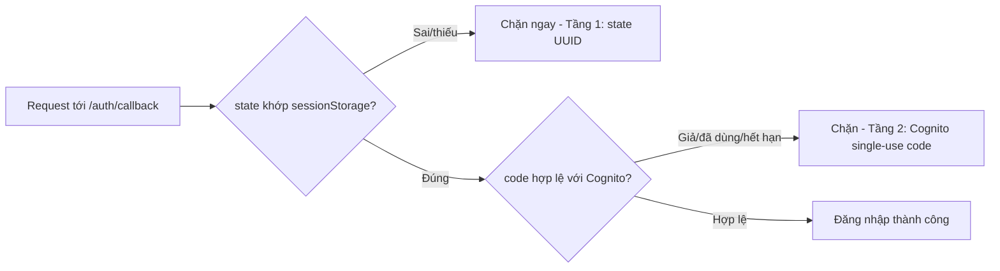

Phần này kiểm tra các cơ chế bảo vệ hệ thống: validate dữ liệu đầu vào (chống XSS), giới hạn CORS, xác thực JWT, và rà soát lại checklist bảo mật tổng thể của hệ thống so với khuyến nghị production.

### 1. Kiểm thử Input Validation

**Bảng quy tắc kiểm tra dữ liệu đầu vào:**

| Trường | Ví dụ hợp lệ | Ví dụ không hợp lệ | Thông báo lỗi |
|-------|----------------|------------------|---------------|
| **Phone** | 0901234567 → +84901234567<br/>+84901234567 (E.164) | "123456" (too short)<br/>"+1234567890" (non-VN)<br/>"abcdefghij" (non-digit) | "Invalid phone format"<br/>"Only Vietnam (+84) supported"<br/>"Phone must contain digits" |
| **DOB** | 1990-01-15<br/>1900-01-01 (minimum)<br/>2026-12-31 (maximum) | 2027-01-01 (future)<br/>1899-12-31 (too old)<br/>1990-13-45 (invalid date) | "DOB cannot be in the future"<br/>"DOB must be after 1900"<br/>"Invalid date format" |
| **Fullname** | "Nguyen Van A"<br/>"Trần Thị Bích Ngọc" (unicode)<br/>"John Doe" | "A" (< 2 chars)<br/>`<script>alert(1)</script>` (XSS)<br/>"x" × 101 (> 100 chars)<br/>"" (empty) | "Min 2 chars"<br/>"XSS prevention"<br/>"Max 100 chars"<br/>"Fullname required" |

**Độ phủ unit test:**
- `backend/test_validators_unit.py` → **50+ test** bao phủ các edge case
  - TestPhoneValidation (15 test)
  - TestDOBValidation (12 test)
  - TestFullnameValidation (10 test)
  - TestEdgeCases (13 test)

**Chạy test:** `cd backend/ && pytest test_validators_unit.py -v`

---

### 2. Kiểm thử CORS & JWT

**Bảng tổng hợp test case:**

| # | Test Case | Input | Expected Result | Status |
|---|-----------|-------|-----------------|--------|
| **CORS VALIDATION** |
| 3.1 | Allowed origin (CloudFront) | Origin: https://dutf3c70nnjzl.cloudfront.net | 200 OK + CORS headers<br/>`Access-Control-Allow-Origin: https://dutf3c...` | PASS |
| 3.2 | Disallowed origin | Origin: https://evil.com | 403 Forbidden (no CORS header) | PASS |
| 3.3 | OPTIONS preflight | OPTIONS request with CORS headers | 200 OK + Access-Control-Allow-Methods: GET, POST, PUT, DELETE, OPTIONS | PASS |
| **JWT AUTHENTICATION** |
| 3.4 | Missing JWT token | No Authorization header | 401 Unauthorized<br/>Error: "Missing Authorization header" | PASS |
| 3.5 | Invalid JWT format | Bearer invalid_token_xyz | 401 Unauthorized<br/>Error: "Invalid JWT token" | PASS |
| 3.6 | Expired JWT token | JWT with exp < current time | 401 Unauthorized<br/>Error: "JWT token has expired" | PASS |
| 3.7 | JWT from different pool | JWT signed by wrong Cognito pool | 401 Unauthorized<br/>Error: "Invalid JWT issuer" | PASS |

**Luồng xác thực JWT trong Lambda:**
```python
# modules/auth_service.py
def validate_jwt(token: str) -> dict:
    # 1. Decode header to get key ID (kid)
    # 2. Fetch Cognito JWKS from well-known endpoint
    # 3. Verify signature with public key
    # 4. Check exp claim (expiration)
    # 5. Check iss claim (issuer = Cognito pool)
    # 6. Return decoded claims (user_id, email, etc.)
```

**Ghi chú về CORS:**
- **[YES]** Đã fix: bỏ wildcard CORS `*`
- **[YES]** Chỉ cho phép 3 origin: CloudFront + localhost:5173 + localhost:5174
- **[NOTE]** Production: nên bỏ các origin localhost trước khi deploy thật

---

### 3. Kiểm thử CSRF State Parameter (Google OAuth)

Luồng đăng nhập Google qua Cognito Hosted UI trước đây không có tham số `state`, cho phép attacker dụ nạn nhân click 1 link chứa authorization code do attacker tạo sẵn (Login CSRF). Đã bổ sung `state = crypto.randomUUID()` sinh ở Frontend, lưu tạm `sessionStorage`, verify khi Cognito redirect về `/auth/callback`.

**Test case đã thực hiện trên production:**

| # | Test Case | Cách thực hiện | Kết quả mong đợi | Status |
|---|-----------|-----------------|-------------------|--------|
| 1 | Login Google bình thường | Đăng nhập qua tab ẩn danh | Vào `/app` thành công | PASS |
| 2 | `state` xuất hiện trong URL | DevTools Network → check request `/oauth2/authorize` | Có `state=<UUID>` | PASS |
| 3 | `state` sai (giả lập CSRF) | Sửa tay `state` trong URL callback | Redirect `/login` + báo lỗi, không gọi tới Cognito | PASS |
| 4 | `state` đúng nhưng `code` giả | Dùng đúng `state` thật + `code` giả | Qua được tầng 1 (state), bị Cognito từ chối ở tầng 2 (invalid_grant) | PASS |
| 5 | sessionStorage tự dọn dẹp | Kiểm tra `oauth_state` sau mỗi lần verify | Key bị xóa (chống replay) | PASS |

**Cơ chế 2 tầng bảo vệ độc lập:**



Chi tiết đầy đủ tham khảo `BANGIAO-23-07-2026.md` (mục 2.3).

---

### 4. Rà soát checklist bảo mật

Tham khảo: `SECURITY_CONSIDERATIONS.md`

| Hạng mục bảo mật | Trạng thái | Ghi chú |
|-----------------|--------|-------|
| **Xác thực (Authentication)** | **Đã triển khai** | Cognito JWT token |
| **Phân quyền (Authorization)** | **Đã triển khai** | Cô lập dữ liệu theo từng user |
| **Validate đầu vào** | **Đã triển khai** | Validator cho phone, DOB, fullname |
| **Chống XSS** | **Đã triển khai** | Chặn thẻ `<script>` trong fullname |
| **Giới hạn CORS** | **Đã fix** | Đã bỏ wildcard |
| **CSRF protection (OAuth state)** | **Đã triển khai** (23/07/2026) | Xem mục 3 phía trên |
| **Mã hóa DynamoDB (KMS)** | **Đã triển khai** (23/07/2026) | SSE-KMS, key `alias/aws/dynamodb` |
| **Chỉ dùng HTTPS** | **Bắt buộc** | TLS 1.2+ trên CloudFront/API Gateway |
| **SQL injection** | **Không áp dụng** | Không dùng SQL database (DynamoDB) |
| **Rate limiting** | **Chưa triển khai** | Cognito đã có throttling/lockout built-in miễn phí; AWS WAF (~$5-10/tháng) chưa tương xứng với quy mô demo/thực tập hiện tại — khuyến nghị bổ sung khi lên production với traffic lớn hơn |
| **Mã hóa dữ liệu lưu trữ** | **Đã triển khai (một phần)** | DynamoDB đã bật SSE-KMS; S3 giữ SSE-S3 mặc định (đã tự động mã hóa từ 2023) |
| **Cô lập VPC** | **Chưa cấu hình** | Lambda chạy ngoài VPC (public) |
| **OAuth state parameter** | **Đã triển khai** | Đã thêm state chống CSRF cho luồng Google OAuth |
| **MFA** | **Chưa bật** | Có thể bật trong Cognito ở giai đoạn sau |

**Khuyến nghị cho production:**
1. Triển khai per-user rate limiting qua AWS WAF khi traffic tăng
2. Thêm API Gateway resource policy (IP whitelist) cho các endpoint quản trị
3. Bật Cognito MFA cho các thao tác nhạy cảm
4. Triển khai Lambda trong VPC với NAT Gateway nếu cần cô lập network sâu hơn

---